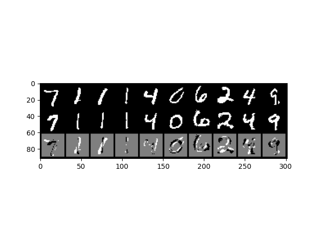

# pytorch-rbm
## 画像生成
以下のコマンドを実行することでデフォルトのハイパーパラメータを用いてRBMの訓練が行われます
```
python3 train.py
```

引数を指定することで隠れ層のサイズや学習率の変更やGPUの使用などが可能です
```
python3 train.py --hidden_size 512 --lr 0.1 --device_id cuda:0
```

指定可能な引数を調べたい場合は以下のコマンドを実行するか、train.pyを確認してください
```
python3 train.py -h
```


## 結果
訓練途中の生成画像や再構成誤差をtensorboardXで確認することが可能です。以下のコマンドを実行してください
```
tensorboard --logdir log/
```

figディレクトリに以下のような結果が格納されます。上段は入力画像、中段は再構成画像、下段は差分画像になっています。


また、平均自由エネルギーのプロットも保存されます。trainとtestの平均自由エネルギーの差をモニターすることで過学習の監視が可能です。
平均自由エネルギーは以下の式の計算結果をミニバッチで平均した値です
```math
\begin{align}
b(x) &= (b^{\mathrm{H}})^{\mathrm{T}} + x^{\mathrm{T}}W\\
F_{\theta}(x) &= -(b^{\mathrm{V}})^{\mathrm{T}}x - \sum^M_{i=1} \log(1 + \exp(b_i(x)))
\end{align}
```

## クラス分類

以下を実行することで、MNIST画像分類を生成的アプローチで行うことができます。
```
python3 train_classification.py
```
生成的アプローチは画像ベクトル $\mathbf{v}$ とラベル $\mathbf{t}$ の同時分布 $p(\mathbf{v},\mathbf{t})$ をモデル化して尤度最大化を行います。クラス分類の際はある画像に対してクラスラベル $\mathbf{t}_1,...,\mathbf{t}_K$ を用意し、それぞれでエネルギー $E(\mathbf{v},\mathbf{t}_1),...,E(\mathbf{v},\mathbf{t}_K)$ を計算し、エネルギーが最小のクラスに画像を分類します。


## TODO
以下のオプションを実装予定です
+ [ ] 隠れ層の活性率の可視化 
+ [ ] 自由エネルギー、期待自由エネルギーによる回帰モデル
+ [ ] 深層ボルツマンマシン、動的ボルツマンマシン
+ [x] 画像分類モデルの実装
